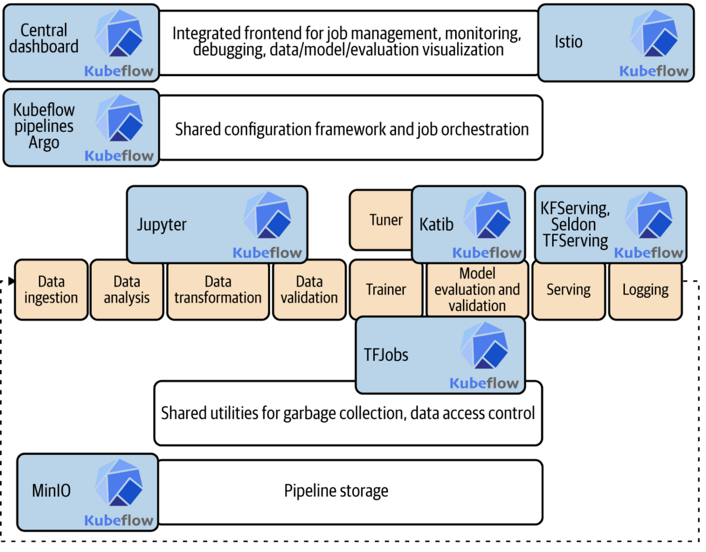

## Kubeflow



- **Kubernetes를 활용한 머신 러닝 툴킷**
- experiment, production phase에 따른 동작 방식
- Kubeflow vs MLflow 구도
    
    다른 툴 (airflow, argo 등) 도 있는데 순수하게 ML 용이 아니기도 하고, 이러한 툴을 병용해서 쓰는 경우가 많아서 비교대상은 아님
    
    간단하게 구현한다면 mlflow, airflow 조합도 괜찮고, k8s 클러스터 기반으로 구현한다면 kubeflow가 좋아보임 
    

### Experiment
- 학습 : 기존에 사용하던 ML framework 연동,  Jupyter notebook
- 하이퍼파라미터 튜닝 : katib

### Production
- 서빙 : KFServing, TensorRT, TFServing, seldon
- 모니터링 : TensorBoard
- 로깅, 시각화 : pipelines

### 제어
- 대시보드 이용하여 제어  → 직관적
- Python SDK 사용  → 파이썬 이용
- REST API 사용  → language agnostic
- kubectl 사용  → k8s 전용 클라이언트로 제어

### 노트북 서버
- Jupyter notebook 과 연동 가능
- k8s 클러스터 기반이므로 기존처럼 하나의 장비에서 여러명이 작업할때의 자원 경쟁 상황을 예방할 수 있음.
- 주의할 점은 기본적으로 Pod로 구동되고 Pod는 stateless 이므로, 별도의 PV 를 통해 데이터를 보존해야 함

### Pipelines (KFP)

Airflow, Argo 처럼 DAG 형태의 작업 흐름 (pipeline) 지정 가능

DAG (direct acyclic graph) : 방향이 있고 순환이 없는 그래프

- 파이프라인은 Workflow라는 kind를 가진 CR(Custom Resource)이다.
- python SDK로 파이프라인 작성 및 컴파일 가능
    
    파이프라인을 직접 yaml로 작성하는 것은 매우 어려우므로, 파이썬 이용해서 작성 가능
    
- RUN
    
    UI, CLI, REST, python 등으로 파이프라인 실행 가능
    
- 전체 구조
    
.png>)

### KFServing (KServe)

- kubeflow에서의 서빙 프레임워크
- pytorch, xgboost, onnx, tensorRT 등 지원
- 기본적인 서빙 프레임워크긴 하나, 같은 쿠버네티스 생태계의 BentoML, Seldon-Core 등으로 대체 가능

### Katib

- 하이퍼 파라미터 튜닝

### Training Operators

tensorflow, pytorch, xgboost 등 각각의 머신러닝 프레임워크를 k8s 기반으로 래핑한 CR들을 하나로 통합한 기능

### multi tenancy

유저 및 그룹 관리. 인증과 인가 부여

## 설치

윈도우 환경에서 설치법인데 다른 환경도 비슷함.

### **1. Minikube 설치**

Minikube는 Kubernetes 클러스터를 로컬에서 실행할 수 있게 해줍니다. Minikube를 설치하기 위해 아래 단계를 따르세요:

1. **Chocolatey 설치:** Windows 패키지 관리자입니다. 관리자 권한으로 PowerShell을 열고 다음 명령을 실행합니다
    
    ```powershell
    Set-ExecutionPolicy Bypass -Scope Process -Force; `
    [System.Net.ServicePointManager]::SecurityProtocol = [System.Net.ServicePointManager]::SecurityProtocol -bor 3072; `
    iex ((New-Object System.Net.WebClient).DownloadString('https://community.chocolatey.org/install.ps1'))
    ```
    
2. **Minikube 설치:** Chocolatey를 사용하여 Minikube를 설치합니다.
    
    docker는 설치되었다고 가정
    
    ```powershell
    choco install minikube
    ```
    
    - docker 관련 에러 발생시
        
        `docker context use default`
        

### **2. Kubectl 설치**

Kubectl은 Kubernetes 클러스터와 상호작용하기 위한 도구입니다. 역시 Chocolatey를 사용하여 설치할 수 있습니다.

```powershell
choco install kubernetes-cli
```

### **3. Minikube 클러스터 시작**

Docker 드라이버를 사용하여 Minikube 클러스터를 시작합니다.

```powershell
minikube start --driver=docker
```

### **4. Kubeflow 설치**

1. git clone
    
    [kubeflow/manifests at v1.8.1 (github.com)](https://github.com/kubeflow/manifests/tree/v1.8.1)
    
2. tag를 최신으로 변경 (여기선 1.8.1)
    
    `git checkout tags/v1.8.1`
    
3. README 보고 설치
    
    위 git 의 특정 tags로 이동하면 README에 설치법이 나와있음
    
    kustomize 기반으로 kubeflow의 여러 요소를 개별적으로 설치할 수 있는데, 이 명령어를 그대로 붙여넣어서 실행하면 됨
    
    ex) `kustomize build common/cert-manager/cert-manager/base | kubectl apply -f -`
    
4. install 대기
    
    pod들은 개별적인 네임스페이스 위에 설치되는데 대부분 kubeflow 아래에 있다
    
    `kubectl get pods -n kubeflow`
    
5. 전부 설치 확인
    
.png>)
    

### **5. Istio Ingress Gateway 포트 포워딩**

Kubeflow 설치가 완료되면, 포트 포워딩을 설정하여 로컬에서 접근할 수 있도록 합니다.

```powershell
kubectl port-forward svc/istio-ingressgateway -n istio-system 8080:80
```

8080으로 expose 되었으므로 접속 가능

`localhost:8080`


- 접속 정보
    - kubeflow manifests 배포 시, user 접속 정보 관련 설정을 변경하지 않은 경우의 default 접속 정보
        - ID : [user@example.com](mailto:user@example.com)
        - PW : 12341234

## Pipelines

### 개념

- Pipeline 과 Component 의 관계
    - Component : 재사용 가능한 형태로 분리된 하나의 작업 단위
    - Pipeline : 여러 Component 들의 연관성, 순서에 따라 연결지은 그래프(DAG)
    
        
- 쿠버네티스 관점에서는 다음과 같은 리소스에 매핑
    - Pipeline : Workflow
    - Component : Pod
- **Component**
    - 하나의 component 는 k8s 상에서는 하나의 독립적인 pod 으로 생성
    - **base_image 지정을 통해** 항상 동일한 환경에서 정해진 코드가 실행되는 것을 보장.
        
        기본 image 는 python 3.7
        
        그 외에도 데코레이터에 전달할 수 있는 파라미터들이 존재함
        
    - 따라서 하나의 pipeline 내에서 연속된 component 라고 하더라도 memory 를 공유하는 일은 일어나지 않음
    - 일반적으로 서로 다른 component 간의 data 공유는 input/output 변수 혹은 파일경로로 넘겨주는 방식을 사용합니다.
        
        pvc 를 공유하는 방식을 사용할 수도 있습니다.
        

### 실습

공식 문서 참고

1. 전제 조건
    - kustomize로 kubeflow에 pipelines 관련 add on 설치
    - pip install kfp
2. 파이썬 코드 작성
    
    ```python
    from kfp import dsl
    
    @dsl.component
    def add(value_1: int, value_2: int) -> int:
        ret = value_1 + value_2
        return ret
    
    @dsl.component
    def subtract(value_1: int, value_2: int) -> int:
        ret = value_1 - value_2
        return ret
    
    @dsl.component
    def multiply(value_1: int, value_2: int) -> int:
        ret = value_1 * value_2
        return ret
    
    @dsl.pipeline(name="add example")
    def my_pipeline(value_1: int, value_2: int):
        task_1 = add(value_1=value_1, value_2=value_2)
        task_2 = subtract(value_1=value_1, value_2=value_2)
        task_3 = multiply(value_1=task_1.output, value_2=task_2.output)
    ```
    
    - component는 `@dsl.component` 로 처리
    - pipelines은 `@dsl.pipeline` 으로 처리
    - 데이터를 넘길때는 무조건 keyword argument여야 함. (positional 은 지원되지 않음)
3. 실행
    1. 명령어로 실행
        
        `kfp dsl compile --py src/operate.py --output my_pipeline.yaml`
        
        yaml 파일이 하나 만들어짐
        
    2. 파이썬 코드로 실행
        
        ```python
        from kfp.compiler import compiler
        
        compiler.Compiler().compile(my_pipeline, 'pipeline.yaml')
        ```
        
4. 업로드
    
    이 파일을 kubeflow 대시보드에 업로드
    
- 주의 사항
    1. 함수 밖에서 선언된 코드는 import 조차도 사용해서는 안됩니다.
    2. **단,** 해당 python 함수를 component 로 만들 때, **base_image** 로 사용하는 **Docker 이미지**에 들어있는 코드는 함수 내부에 선언하지 않아도 사용할 수 있습니다.

### 추가 기능
1. 파일 기반으로 컴포넌트 간 데이터 전달
